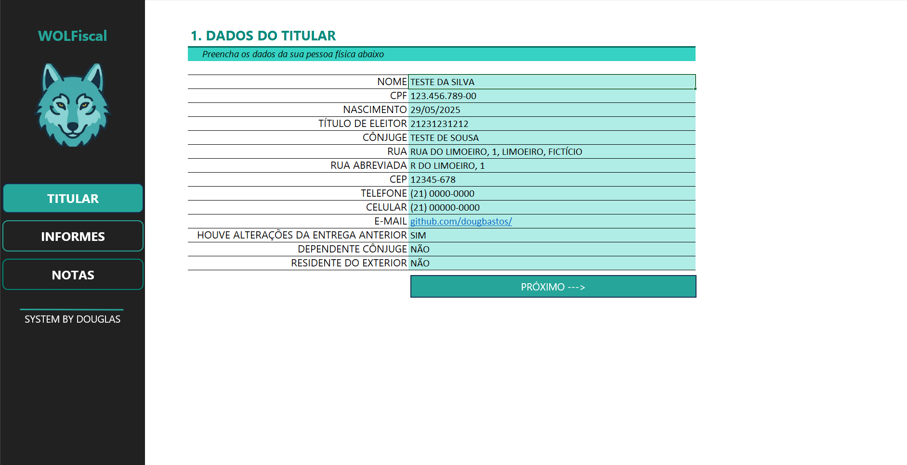
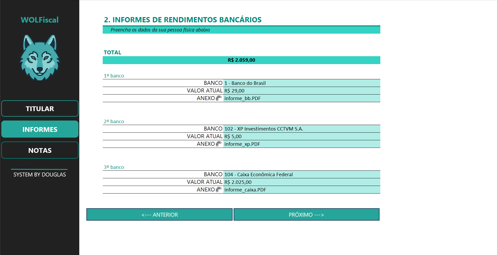
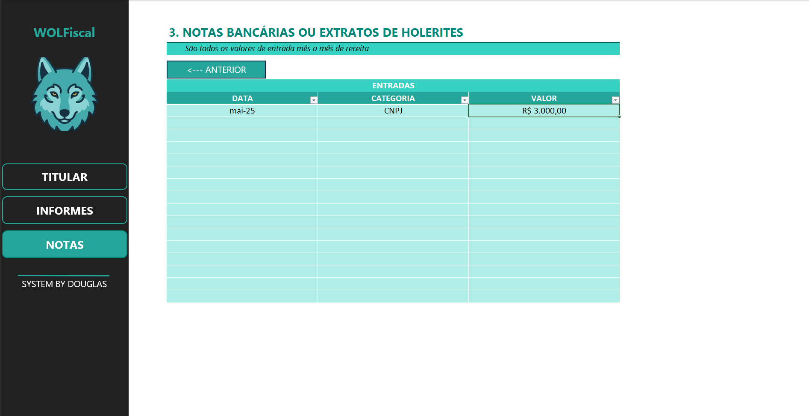

# 📊 Organizador de Imposto de Renda – Projeto DIO

## 🧠 Entendendo o Desafio

Este projeto foi desenvolvido como parte do desafio "Entendendo o Desafio" da plataforma DIO (Digital Innovation One). O objetivo é aplicar conhecimentos práticos em Excel para construir uma ferramenta funcional, com documentação técnica no GitHub.

---

## 📌 Descrição do Projeto

Este projeto visa facilitar a organização de informações para a **declaração de Imposto de Renda** por meio de uma ferramenta 100% desenvolvida no Excel.

A proposta inclui:
- Menus de navegação intuitivos
- Validação automática de dados
- Organização por abas e categorias
- Interface amigável para o usuário
- Links rápidos e campo de anotações personalizadas

---

## 🎯 Objetivos de Aprendizagem

- Aplicar os conceitos aprendidos em um ambiente prático e real
- Documentar processos técnicos de forma clara e estruturada
- Utilizar o GitHub como ferramenta para compartilhamento de soluções

---

## 🗂 Conteúdo do Repositório

- `Organizador-IR.xlsx` — Planilha com a ferramenta
- `README.md` — Arquivo de documentação
- `images/` — Pasta com capturas de tela:

  - `tela-titular.png`
  - `tela-informes.png`
  - `tela-notas.png`

---

## 🖼️ Capturas de Tela

### Tela Titular

### Tela Informes

### Tela Notas

---

## 🔍 Detalhamento das Funcionalidades

Esta planilha Excel foi desenvolvida para organizar e controlar informações essenciais para a declaração do Imposto de Renda, com foco na facilidade de uso e validações automáticas para evitar erros.

### Funcionalidades Principais:

- **Menu de Navegação**  
  Um painel inicial com botões que permitem acessar rapidamente as principais abas da planilha, facilitando a navegação sem necessidade de procurar manualmente.

- **Tela Titular**  
  Aqui você cadastra os dados pessoais do titular da declaração, como nome, CPF, endereço e demais informações básicas que serão utilizadas para gerar relatórios.

- **Tela Informes**  
  Nesta aba, insira os informes de rendimentos, como salários, aluguéis recebidos, investimentos, etc. A planilha valida automaticamente os campos obrigatórios para garantir a integridade dos dados.

- **Tela Notas**  
  Utilize esta seção para registrar notas fiscais, recibos e documentos comprobatórios que auxiliam na comprovação das despesas e rendimentos.

- **Validações Automáticas**  
  A planilha possui regras embutidas que alertam caso alguma informação esteja incorreta ou incompleta, garantindo a qualidade dos dados para a declaração.

- **Links Rápidos**  
  Botões e atalhos para documentos e guias úteis, otimizando seu tempo e facilitando o acesso a informações complementares.

### Como usar:

1. **Preencha os dados na Tela Titular** com suas informações pessoais.  
2. **Insira os rendimentos e despesas na Tela Informes**, certificando-se de que todos os campos obrigatórios estejam preenchidos.  
3. **Registre documentos na Tela Notas** para manter um controle organizado das comprovações.  
4. **Use o Menu de Navegação** para alternar entre as abas e verificar suas informações.  
5. **Confira as validações** que aparecerão para corrigir qualquer inconsistência antes de finalizar a organização.

---

## 📁 Download da Planilha

Você pode baixar a ferramenta diretamente aqui:

➡️ [Clique para baixar o Organizador-IR.xlsx](./Organizador-IR.xlsx)

---

## 📚 Aprendizados e Considerações

Este desafio foi essencial para desenvolver uma aplicação funcional com foco no usuário final. Foi possível explorar recursos como **validação de dados, formatação condicional, navegação por botões e organização de informações sensíveis**. Além disso, foi uma excelente oportunidade para praticar versionamento e documentação no GitHub.

---

**Desenvolvido por Douglas Bastos ✨**
